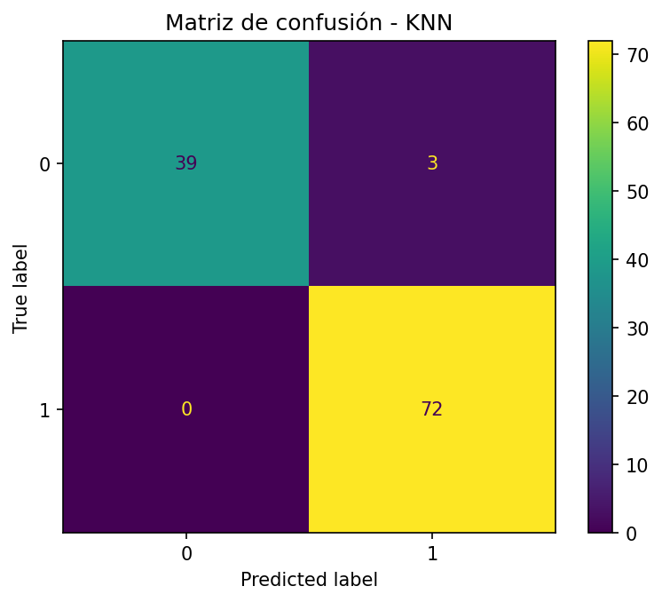
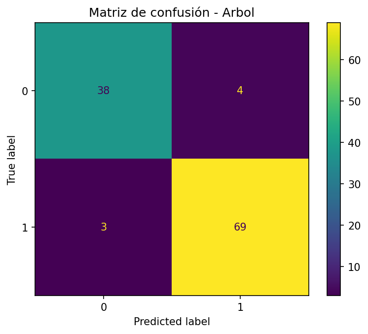

# Clase 5 – Árbol de Decisión vs K-NN

**Dataset:** Breast Cancer Wisconsin (Diagnostic) – `sklearn.datasets`  
**Objetivo:** Clasificar benigno vs maligno y comparar **K-NN** (con escalado) vs **Árbol de Decisión** (sin escalado).

## Metodología
- Split: `train_test_split(test_size=0.2, stratify=y, random_state=42)`
- Validación: `StratifiedKFold(n_splits=5, shuffle=True, random_state=42)`
- **K-NN**: `Pipeline(StandardScaler(), KNeighborsClassifier)`  
  Grid: `n_neighbors ∈ {1,3,5,7,9,11,15}`, `weights ∈ {uniform, distance}`
- **Árbol**: `DecisionTreeClassifier`  
  Grid: `max_depth ∈ {None,3,5,7,10}`, `min_samples_leaf ∈ {1,3,5}`
- Métricas en test: **Accuracy** y **F1-macro**.

## Resultados (test)
| Modelo | Mejores hiperparámetros | Accuracy | F1-macro |
|---|---|---:|---:|
| **K-NN** | `{'clf__n_neighbors': 9, 'clf__weights': 'uniform'}` | **0.973684** | **0.971277** |
| **Árbol** | `{'max_depth': 3, 'min_samples_leaf': 5}` | 0.938596 | 0.933693 |

**Figuras**  
  

## Conclusiones
- **Preprocesamiento:** K-NN requiere **escalado** (distancias); el Árbol no.  
- **Rendimiento:** En este dataset numérico, **K-NN (k=9)** superó al Árbol tanto en Accuracy como en F1-macro.  
- **Trade-offs:** K-NN es sensible a la escala y a *k*. El Árbol brinda **interpretabilidad** y rapidez, pero hay que controlar `max_depth`/`min_samples_leaf` para evitar sobreajuste.

